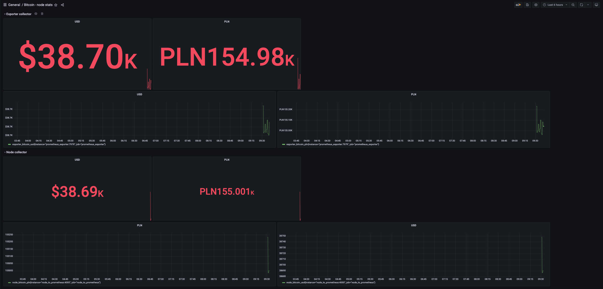

# grafana-prometheus-bitcoin-exchange

Run `docker-compose up` to set up whole stack

This app creates 4 services:
* grafana - available under http://localhost:3000 (user/password admin/admin)
* prometheus - available under http://localhost:9090
* node.js app that collects Bitcoin exchange and exposes in Prometheus format - available under http://localhost:4000
* Prometheus json exporter that does the same thing as node.js app - available under http://localhost:7979. Example output: http://localhost:7979/probe?target=https%3A%2F%2Fapi.coindesk.com%2Fv1%2Fbpi%2Fcurrentprice%2FPLN.json

## To do

* Create dashboard like the one from screenshot. Use both sources (node.js app and prometheus-exporter)

* create alert - when USD exchange rate is bigger than X, send a notification. In order to do this, you have to configure notification channel. Use Slack or Webhook - but something that you will be able to test.
